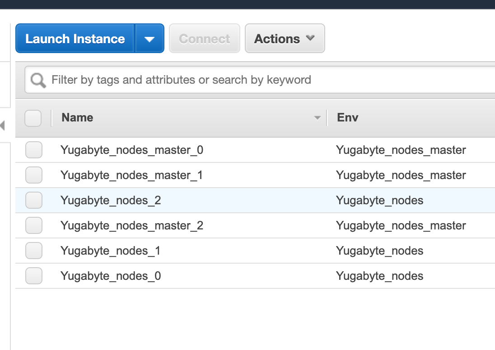
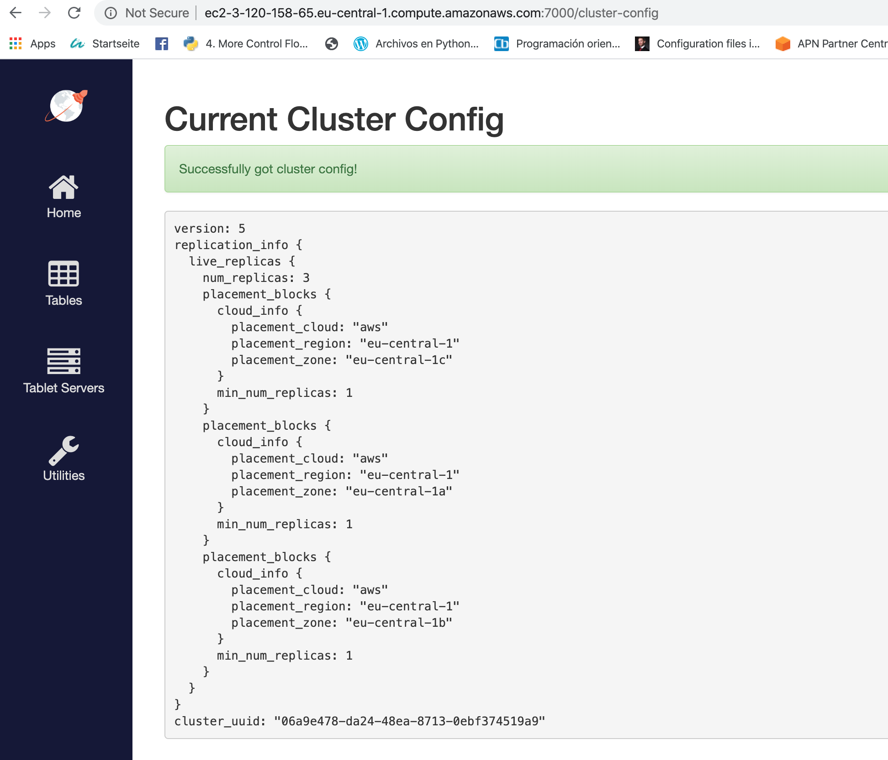

# Yugabyte DB automated cloud provisioning using AWS and Ansible  

The goal is to create Ansible recipes/playbooks for deploying YugabyteDB on AWS by means of the following guidelines:
- Multi AZ support (3 as per the current implementation and configurable) 
- based on terraform one: https://docs.yugabyte.com/latest/deploy/public-clouds/aws/#terraform
- based on https://docs.yugabyte.com/latest/deploy/public-clouds/aws/#manual-deployment
- Orchestration by using Ansible as a server configuration management tool
- Number of public subnets, availability zones and instances can be parametrized.
- Uses aws_ec2 for AWS dynamic inventory 

### Prerequisites 📋


First, some things you will need:

```
Ansible at least 2.8
Amazon console api
An Amazon AWS account
IAM credentials to login to the AWS account
Python 3+
Virtualenv
Boto
Ansible-vault
```

For reference, the webservice was deployed by using MacOS Mojave 10.14.5.

### Overview 🔧
The repository contains a set of parametrized ansible playbooks and roles, with which multiple AZ and subnets can be created. 

 - A [VPC](http://docs.aws.amazon.com/AmazonVPC/latest/UserGuide/VPC_Introduction.html) with 3 public subnets (more can be added), spanned within an AWS region.
 - A multi-az Yugabyte DB cluster across three [Availability Zones](http://docs.aws.amazon.com/AWSEC2/latest/UserGuide/using-regions-availability-zones.html)
 - 1 master server is created per availability zone, the rest of instances are automatically allocated in the different public subnets and az's.
 - AWS secret and access keys have to be specified within creds.yml file via ansible-vault.
 - The deployment is mostly dynamic meaning it is using instance groups based on aws tags.

## Deployment 📦

The following roles are used:

| Template | Description |
| --- | --- | 
| [roles/yugabyte_vpc](roles/yugabyte_vpc) | this does not only orchestrates a VPC including there public subnets distributed across three Availability Zones, but it also deploys an [Internet gateway]. (http://docs.aws.amazon.com/AmazonVPC/latest/UserGuide/VPC_Internet_Gateway.html), with a routing table on the public subnets.|
| [roles/configure_region_placement](roles/configure_region_placement) | Configures AZ- and region-aware placement based on a replication factor of 3.  |
| [roles/yugabyte_common](roles/yugabyte_common) | Installs required system packages (for centos in this case), configures ulimits, creates needed folders for deployment as well as installing yugabyte db on every node. |
| [roles/yugabyte_ec2](infrastructure/ecs-cluster.yaml) | Deploys a dynamic set of ec2 instances as per the variable file (in this case 6) and attaches them to the public subnets (1 master instance per availability zone and the other ones spawned accross the all AZ) |
| [roles/yugabyte_ec2_sg](services/WebService.yaml) | It is possible to configure the [security groups](http://docs.aws.amazon.com/AmazonVPC/latest/UserGuide/VPC_SecurityGroups.html) required by the entire stack on [roles/yugabyte_ec2_sg/defaults/main.yml](roles/yugabyte_ec2_sg/defaults/main.yml) |
| [roles/yugabyte_setup](services/WebService.yaml) | Propagates Jinja template values for master.conf (YB-Master servers) and tserver.conf (YB-TServer servers) dinamically |
| [roles/yugabyte_tbserver_startup](roles/yugabyte_tbserver_startup) | Initiliazes YB-Master servers as well as YB-TServer servers on the required nodes. |


The orchestration as well as deployment happen through ansible initializing first a python virtual environment, thus, you can trigger it as follows:

Make sure to indicate your aws secret and access keys within creds.yml:
```
ansible-vault create creds.yml

.......

aws_access_key: "your access key"
aws_secret_key: "your secret key"

```
Initialize the virtual environment with python 3:
```
virtualenv3 -p python3 .venv
```
Acvitvate the virtualenvironment:
```
source .venv/bin/activate
```
Install dependencies:
```
pip3 install -r requirements.txt
```
Run the ansible recipes
```
ansible-playbook -i aws_ec2.yml main.yml --ask-vault-pass
```

Sample output is as follows:
```
TASK [Gathering Facts] ***************************************************************************************
ok: [localhost]

TASK [yugabyte_vpc : create VPC] *****************************************************************************
ok: [localhost]

TASK [yugabyte_vpc : Set VPC ID in variable] *****************************************************************
ok: [localhost]

TASK [yugabyte_vpc : create IGW] *****************************************************************************
ok: [localhost]

TASK [yugabyte_vpc : Route IGW] ******************************************************************************
ok: [localhost]

TASK [yugabyte_ec2_sg : Create Security Group] ***

.........

```

## Testing ⚙️

The infrastructure orchestration can be depicted next:


Master Yugabyte DB details:


Cluster config:


### Adjusting Instance types

This is specified in the main ansible playbook (main.yml)

By default, [t2.micro](https://aws.amazon.com/ec2/instance-types/) instances are utilized and can be changed on the ansible group_vars/main.yml file.

```
- name: Change details for the Yugabyte DB cluster in group_vars/all.yml
  region: "eu-central-1"
  type_instance: t2.micro
cloud: aws
ec2_tag: "Yugabyte_nodes"
ansible_user: centos 
#The local path to which we would save our EC2 Private Key
ec2_key_directory: "./"
keypair_name: "ec2_key_pair"
key_location: "~/Documents/yugabyte_exam/key.ppk"

conf_dir: "~/yb-conf"
software_dir: "~/yb-software"

YB_VERSION: 2.1.2.0

TAR_FILE: "yugabyte-{{ YB_VERSION }}-linux.tar.gz"

ulimits_security:
  - { limit_type: '-', limit_item: 'core', value: unlimited }
  - { limit_type: '-', limit_item: 'nofile', value: 1048576 }
  - { limit_type: '-', limit_item: 'nproc', value: 12000 }

master_dir: "~/master"
tserver_dir: "~/tserver"

linux_distribution: "centos"
centos_release: "7"
...........

```

### Change the VPC or subnet IP ranges

This set of ansible roles deploys the following network design as default (can be modified):

| Item | CIDR Range | Usable IPs | Description |
| --- | --- | --- | --- |
| VPC | 10.185.0.0/16 | 65536 | The whole range used for the VPC and all subnets |
| Public Subnet | 10.185.10.0/24 | 256 | The public subnet in the first Availability Zone |
| Public Subnet | 10.185.11.0/24 | 256 | The public subnet in the second Availability Zone |
| Public subnet | 10.185.21.0/24 | 256 | The public subnet in the third Availability Zone |

Values for VPC and subnets can be modified within the ansible group_vars/all.yml file. Furthermore, It is possible to add more public subnets and one per availability zone. As of now, it is only possible to indicate public subnets.

```
aws_region:     'eu-central-1'
vpc_name:       'Yugabyte_VPC_Res'
vpc_cidr_2:     '185'
vpc_cidr: '10.{{vpc_cidr_2}}.0.0/16'

subnets:
  - type: public
    cidr: "10.{{vpc_cidr_2}}.10.0/24"
    az: a
  - type: public
    cidr: "10.{{vpc_cidr_2}}.11.0/24"
    az: b
  - type: public
    cidr: "10.{{vpc_cidr_2}}.21.0/24"
    az: c
 .........
 .........
```

## License

Copyright 2011-2016 Amazon.com, Inc. or its affiliates. All Rights Reserved.

Licensed under the Apache License, Version 2.0 (the "License"). You may not use this file except in compliance with the License. A copy of the License is located at

[http://aws.amazon.com/apache2.0/](http://aws.amazon.com/apache2.0/)

or in the "license" file accompanying this file. This file is distributed on an "AS IS" BASIS, WITHOUT WARRANTIES OR CONDITIONS OF ANY KIND, either express or implied. See the License for the specific language governing permissions and limitations under the License.


## Built With 🛠️
* [Boto](https://github.com/boto/boto) - AWS interface for python and ansible 
* [Ansible](https://docs.ansible.com/ansible/latest/index.html) - Software configuration management tool to run the playbooks, basically an IT automation tool.

## Authors ✒️

* **Carlos Klinsmann** - *First Version*.

## Acknowledgements 🎁

* Github API & valuable resources.
* Inspiration on the GithHub template: https://gist.githubusercontent.com/Villanuevand/6386899f70346d4580c723232524d35a/raw/8028158f59ba1995b0ca1afd3173bac3df539ca0/README-espa%25C3%25B1ol.md
* Ansible documentation
* Amazon documentation

